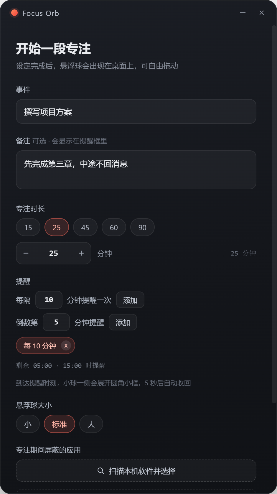
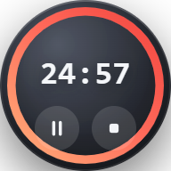

# Focus Orb · 桌面悬浮球番茄钟

一个 Windows 桌面番茄钟：设置好专注时长、事件与提醒后，一个可自由拖动的悬浮球会出现在桌面上持续倒计时；到点提醒时，小球一侧会弹出极简圆角小框，5 秒后自动收回，不打断专注。专注期间还能屏蔽指定应用——一旦打开就自动关掉。



## 功能

- **悬浮球倒计时**：无边框透明圆球，始终置顶（含全屏应用之上），可自由拖动，位置自动记忆
- **进度环**：随时间收缩的渐变圆环，最后 1 分钟变红并缓慢呼吸
- **极简提醒**：到点从球体一侧展开圆角小框，只有「剩余时间 / 事件 / 备注」，5 秒自动收回；无声音、不抢焦点、鼠标穿透
- **两种提醒规则**：每隔 N 分钟提醒、倒数第 N 分钟提醒，可混搭多条，配置时实时预览触发时刻
- **暂停控制**：悬停球体出现暂停/继续与结束按钮；单击球体、右键菜单、系统托盘同样可暂停
- **屏蔽应用**：扫描本机已安装软件，勾选后专注期间自动检测并关闭（详见下方说明）
- **系统托盘**：后台计时、暂停、重新开始、结束、退出
- 三档球体尺寸（80 / 96 / 120），配置与位置持久化

| 悬浮球 | 悬停控制 | 提醒弹窗 |
| --- | --- | --- |
|  |  |  |

## 使用方法

1. 打开应用，填写**事件**、可选**备注**、**专注时长**，添加提醒规则
2. 需要防分心时，点「扫描本机软件并选择」，勾选要屏蔽的应用
3. 点「开始专注」，悬浮球出现在桌面

悬浮球操作：

| 操作 | 效果 |
| --- | --- |
| 拖动 | 移动位置 |
| 悬停后点按钮 | 暂停 / 继续、结束专注 |
| 单击球体 | 暂停 / 继续 |
| 双击球体 | 打开设置窗口 |
| 右键 | 菜单（暂停、重新开始、编辑、结束、退出） |

## 屏蔽应用的工作原理与注意事项

**只在点击「开始专注」后生效**，计时结束或退出程序后立即停止扫描，不会常驻监控。

检测每 3 秒执行一次，命中被屏蔽应用时的处理顺序：

1. 先发送**正常关闭请求**，留 5 秒时间（应用可弹出保存提示）
2. 5 秒后仍未退出，才强制结束进程
3. 单个进程最多重试 3 次，权限不足则放弃，不做死循环

内置保护措施：

- 按**安装路径精确匹配**，不会因为同名进程误伤其它窗口
- 约 30 个系统关键进程（`explorer.exe`、`dwm.exe`、`svchost.exe` 等）在扫描结果中隐藏且不可勾选，运行时再兜底拦截
- 本程序自身进程永久保护
- 微软商店应用（UWP）无法可靠获取路径，已从列表剔除
- 仅查询被屏蔽的少数进程名（WMI 服务端过滤），CPU 开销极低

> 提醒：强制结束进程可能造成未保存内容丢失。请谨慎选择屏蔽对象，重要文档请先保存。

## 从源码运行

```bash
npm install
npm start
```

## 打包

```bash
npm run dist
```

产物为免安装单文件 `dist/FocusOrb-<version>.exe`（Windows x64）。

国内网络可先设置镜像加速二进制下载：

```powershell
$env:ELECTRON_MIRROR="https://npmmirror.com/mirrors/electron/"
$env:ELECTRON_BUILDER_BINARIES_MIRROR="https://npmmirror.com/mirrors/electron-builder-binaries/"
```

推送 `v*` 标签或在 Actions 中手动触发，会自动在 Windows 环境打包并上传 exe 产物。

## 目录结构

```
main.js              主进程：窗口、悬浮球拖动、提醒弹窗定位、托盘、软件扫描与屏蔽守护
preload.js           渲染进程与主进程的安全通信桥
src/setup.*          设置窗口（事件、备注、时长、提醒、屏蔽应用、球体大小）
src/orb.*            悬浮球（倒计时、进度环、拖动、悬停控制）
src/apps.*           已安装软件扫描与选择窗口
src/notice.*         提醒弹窗
scripts/make-ico.js  生成应用图标 build/icon.ico
build/icon.ico       打包用图标
docs/screenshots     文档配图
```

## 技术栈

Electron 44 + 原生 HTML/CSS/JS，无运行时第三方依赖；软件扫描与进程管理通过 PowerShell / WMI 完成，图标由代码生成，仓库内不含二进制资源。

## 许可证

[MIT](LICENSE)
